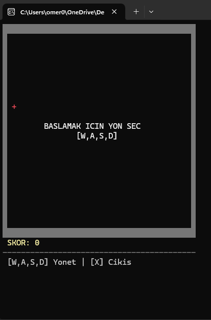
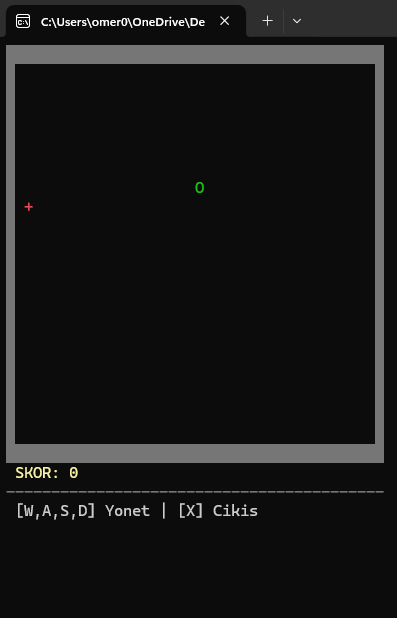

# 🐍 Classic Snake Game (C++ Console)




Bu proje, C++ kullanılarak geliştirilmiş, Windows Konsol üzerinde çalışan gelişmiş bir **Yılan Oyunu**dur. Standart oyun döngüsü (Game Loop), dinamik bellek yönetimi ve Windows API kullanılarak hazırlanmıştır.




## 🌟 Özellikler

* **Renkli Arayüz:** Yılan, yem ve duvarlar için farklı renkler (Windows API).
* **Gelişmiş Kontroller:** `W, A, S, D` tuşları ile akıcı kontrol.
* **Akıllı Başlangıç:** Oyun map'in içinde başlar, oyuncu yön tuşuna basana kadar bekler ve 3 saniye geri sayım yapar.
* **Hız Dengesi:** `Sleep()` fonksiyonu ile optimize edilmiş oyun hızı (110ms).
* **Çarpışma Kontrolü:** Duvarlara veya kendi kuyruğuna çarpma mekaniği.
* **Skor Sistemi:** Yem yedikçe artan skor ve uzayan kuyruk mantığı.

## 🎮 Kontroller

| Tuş | İşlev |
| :--- | :--- |
| **W** | Yukarı Git |
| **S** | Aşağı Git |
| **A** | Sola Git |
| **D** | Sağa Git |
| **X** | Oyundan Çık |

## 🛠️ Kurulum ve Çalıştırma

Bu projeyi bilgisayarınızda çalıştırmak için aşağıdaki adımları izleyebilirsiniz:

1. Bu repoyu klonlayın:
   ```bash
   git clone https://github.com/Omer-Murat/Snake-Game
   ```
   
Geliştirici: Ömer Murat

---
*Bu proje açık kaynaklıdır ve eğitim amaçlı geliştirilmiştir.*
